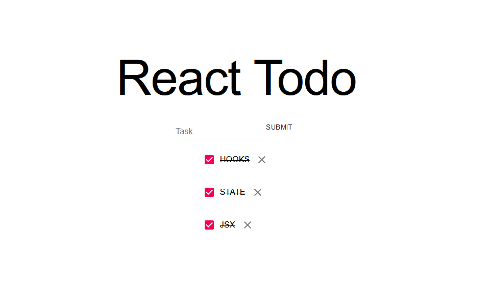

# Todo App

### Description


This is a simple project meant to teach me what is React , how does it work and how can I use it to create web applications.

### Features

- [x]  adds new tasks to the list
- [x]  working checkbox that indicated when the task was completed
- [x]  added tasks can be deleted

### Assignment details

[The basics](https://github.com/becodeorg/ANT-Giertz-4.30/tree/master/3.The-Mountain/React/0.The-Basics](https://github.com/becodeorg/ANT-Giertz-4.30/tree/master/3.The-Mountain/React/0.The-Basics)

[Getting Started](https://github.com/becodeorg/ANT-Giertz-4.30/tree/master/3.The-Mountain/React/1.Getting-Started](https://github.com/becodeorg/ANT-Giertz-4.30/tree/master/3.The-Mountain/React/1.Getting-Started)

[State](https://github.com/becodeorg/ANT-Giertz-4.30/tree/master/3.The-Mountain/React/2.State](https://github.com/becodeorg/ANT-Giertz-4.30/tree/master/3.The-Mountain/React/2.State)

### Create React App:

```bash
npx create-react-app my-app
cd my-app
npm start
			// OR //
// Create a project folder, navigate to it and use//
npx create-react-app .
```

### Documentation

[JSX](https://reactjs.org/docs/introducing-jsx.html](https://reactjs.org/docs/introducing-jsx.html)

[RECONCILIATION](https://reactjs.org/docs/reconciliation.html#gatsby-focus-wrapper](https://reactjs.org/docs/reconciliation.html#gatsby-focus-wrapper)

[STATE](https://reactjs.org/docs/faq-state.html#should-i-use-a-state-management-library-like-redux-or-mobx](https://reactjs.org/docs/faq-state.html#should-i-use-a-state-management-library-like-redux-or-mobx)

[HOOKS](https://reactjs.org/docs/hooks-intro.html](https://reactjs.org/docs/hooks-intro.html)

**REACT COMPONENT LIBRARIES / MATERIAL UI:**

- [INSTALATION](https://next.material-ui.com/getting-started/installation/](https://next.material-ui.com/getting-started/installation/)
